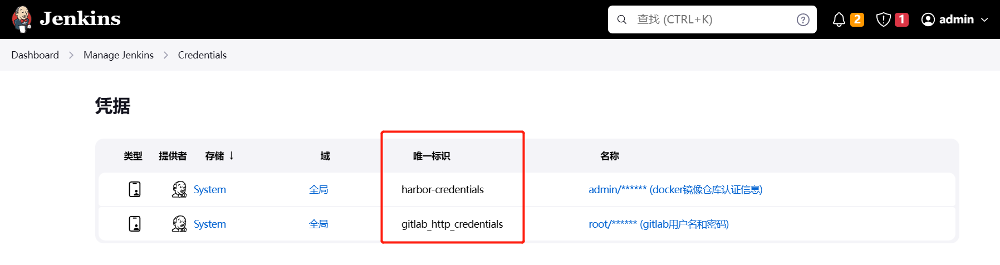
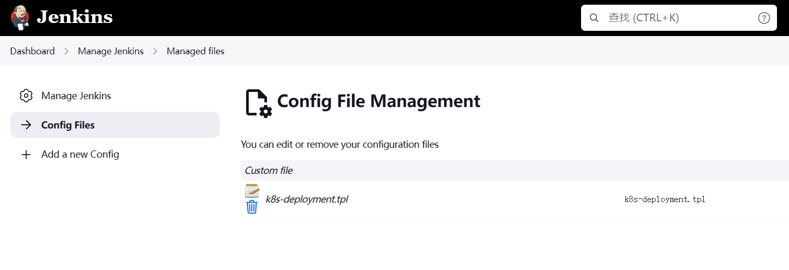
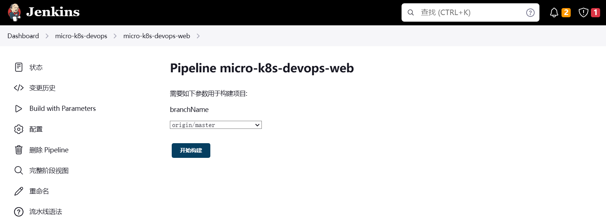

* 虚拟机环境配置，只有一个节点，如下：

```
操作系统：CentOS Linux 7 (Core) Kernel: Linux 3.10.0-693.el7.x86_64
docker：Docker version 20.10.8, build 3967b7d
docker-compose：v2.13.0
k8s：v1.23.0
git：1.8.3.1
maven：3.6.0
Java version: 1.8.0_201
```

* Jenkins安装插件： Git Parameter ， Config File Provider Plugin 

* 其他需要安装的工具：harbor（docker镜像私有仓库），gitlab（代码托管）

* Jenkins需要配置的凭据，唯一标识：harbor-credentials ， gitlab_http_credentials。要和下面流水线脚本的id保持一致



* 在Jenkins Config File插件配置k8s deployment文件模板： k8s-deployment.tpl



k8s-deployment.tpl 文件如下：

```
apiVersion: apps/v1
kind: Deployment
metadata:
  name: {APP_NAME}-deployment
spec:
  replicas: {REPLICAS}
  selector:
    matchLabels:
      app: {APP_NAME}
  template:
    metadata:
      labels:
        app: {APP_NAME}
    spec:
      containers:
      - name: {APP_NAME}
        image: {FULL_IMAGE_NAME}
        imagePullPolicy: IfNotPresent
        env:
         - name: SPRING_PROFILE_ACTIVE
           value: {SPRING_PROFILE}
```

* 在需要部署的java子模块中，添加一份Dockerfile文件，一般和pom.xml文件同一层目录。目前只有open-jdk而没有oracle jdk的公共镜像，并且open-jdk又不算是标准，所以需要自己下载oracle jdk打包成镜像并且推送到私有harbor仓库，然后在Dockerfile引用。

Dockerfile文件如下：

```
# Version 1.0.0
FROM 192.168.3.101:8001/library/oracle-jdk:1.8

MAINTAINER mubai "zhangzehao37@163.com"

# 定义时区
RUN ln -sf /usr/share/zoneinfo/Asia/Shanghai /etc/localtime \
&& echo 'Asia/Shanghai' >/etc/timezone

EXPOSE 8088

# 环境变量
# JAR运行目录
ENV WORK_PATH /home/app
# 日志数据目录
ENV WORK_DATA /home/data
ENV JAVA_OPTS='-XX:+PrintGCDetails -XX:+PrintGCTimeStamps -Xloggc:$WORK_DATA/logs/gc_%p.log -XX:+UseGCLogFileRotation -XX:NumberOfGCLogFiles=5 -XX:GCLogFileSize=30m -XX:+HeapDumpOnOutOfMemoryError -XX:HeapDumpPath=$WORK_DATA/logs/java_heapdump.hprof'
#由jenkins执行docker build注入参数 MEM_ARG, JAR_FILE
ARG MEM_ARG
ENV MEM_OPTS ${MEM_ARG}

ARG JAR_FILE
ADD target/${JAR_FILE} $WORK_PATH/app.jar

#VOLUME
VOLUME $WORK_DATA $WORK_PATH

# 输出JVM参数
RUN echo $MEM_OPTS $JAVA_OPTS

# WORKDIR
WORKDIR $WORK_PATH

ENTRYPOINT java $MEM_OPTS $JAVA_OPTS -jar -Djava.security.egd=file:/dev/./urandom app.jar
```

* 新建Jenkins pipeline项目，粘贴如下脚本，第一次执行Build Now可能会报错，执行第二次Build with Parameters就可以了，会让你选择构建的分支。



Jenkins流水线脚本如下：

```
pipeline{
    agent any
    
    parameters {
        gitParameter defaultValue: 'origin/master', name: 'branchName', type: 'PT_BRANCH', listSize: "0"
    }
    environment {
        GIT_URL = "http://192.168.3.101:20080/common/micro-k8s-devops.git"
        GIT_SUB_MODULE = "micro-k8s-devops-web"
        APP_NAME = "micro-k8s-devops-web"
        ENV_NAME = "dev"
        POD_REPLICAS = "1"
        HARBOR_HOST = "192.168.3.101:8001"
        HARBOR_CREDS = credentials('harbor-credentials')
        IMAGE_NAME = "${env.HARBOR_HOST}/library/${env.APP_NAME}"
        MEM_OPTS = "-XX:+UseParallelGC -Xms64m -Xmx128m -Xss256k -XX:MetaspaceSize=64m -XX:MaxMetaspaceSize=128m -XX:+PrintFlagsFinal"
    }
    stages{
        
        stage ("show branch name") {
            steps {
              echo "selected branch name is $branchName"
            }
        }
     
        stage('pull git code'){
            steps{
                checkout scmGit(branches: [[name: '$branchName']], extensions: [cleanBeforeCheckout()], userRemoteConfigs: [[credentialsId: 'gitlab_http_credentials', url: "${env.GIT_URL}"]])
                script {
                    env.GIT_TAG = sh(returnStdout: true, script: "git rev-parse HEAD").trim()
                    env.FULL_IMAGE_NAME = "${env.IMAGE_NAME}" + ":" + "${env.GIT_TAG}_${BUILD_NUMBER}"
                }
            
                echo "FULL_IMAGE_NAME = ${env.FULL_IMAGE_NAME}"
           }
        }
    
        stage('maven build') {
            steps {
                sh "mvn clean package -U -pl ${env.GIT_SUB_MODULE} -am -Dfile.encoding=UTF-8 -DskipTests=true"
            }
        }
        
        stage('docker build') {
            steps {
                
                sh "docker login -u ${HARBOR_CREDS_USR} -p ${HARBOR_CREDS_PSW} ${env.HARBOR_HOST}"
                sh "docker build --rm --build-arg MEM_ARG='${env.MEM_OPTS}' --build-arg JAR_FILE=`ls ${env.GIT_SUB_MODULE}/target/${env.APP_NAME}*.jar | cut -d '/' -f3` -t ${env.FULL_IMAGE_NAME} ./${env.GIT_SUB_MODULE}"
                sh "docker push ${env.FULL_IMAGE_NAME}"
            }
        }
        
        stage('deploy to k8s') {
            steps {
                configFileProvider([configFile(fileId: 'k8s-deployment.tpl', targetLocation: "${env.GIT_SUB_MODULE}/k8s-deployment.tpl", variable: 'k8s-deployment-file')]) {
                   sh "sed -e 's#{FULL_IMAGE_NAME}#${env.FULL_IMAGE_NAME}#g;s#{REPLICAS}#${env.POD_REPLICAS}#g;s#{APP_NAME}#${env.APP_NAME}#g;s#{SPRING_PROFILE}#${env.ENV_NAME}#g' ${env.GIT_SUB_MODULE}/k8s-deployment.tpl > ${env.GIT_SUB_MODULE}/k8s-deployment.yaml"
                }
                
               sh "kubectl apply -f ${env.GIT_SUB_MODULE}/k8s-deployment.yaml --namespace=${env.ENV_NAME}"
            }
        }
    }
}
```